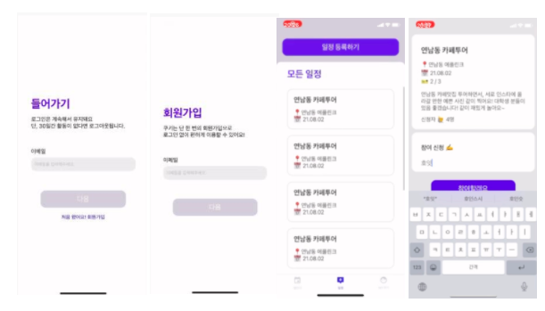

# [ CUKI APP ]
  

**BACKEND SERVER REPOSITORY**
- 원하는 주제로 모임을 모집 혹은 참여할 수 있는 모임문화 플랫폼
- Team Notion: https://www.notion.so/cuki-a1844d3102af4b9abf430b8e4cd10f80
- Team Convention: https://github.com/cuki-app/cuki-app-api/blob/main/CONVENTIONS.md
- cuki api doc: https://cuki.io/swagger-ui.html#/

## Application
- 서비스명: cuki
- 개발기간: 2021.07.04 ~ 2021.12.25
- 개발 인원: 디자이너 1명 + 프론트엔드 1명 + 백엔드 2명
- 개발 환경
  - JDK 1.8
  - Spring Boot 2.5.3 / Spring Security
  - Spring Data JPA / Spring Data Redis
  - Gradle
  - Junit5
  - Github Actions
  - AWS RDS - MySQL, AWS EC2
- 주요 기능
  - 이메일 인증을 통한 회원가입 및 로그인
  - 원하는 주제의 모임을 모집하거나 참여 신청을 통해 모임 형성
  - 회원간의 소통을 위한 댓글 기능 제공

## Experience

<details>
<summary>강미진</summary>

- 회원가입 / 회원탈퇴
  - 회원가입 시 유니크한 닉네임 랜덤 부여 Like-UUID
  - 도메인 유효성 검사
- 로그인 / 로그아웃
  - JWT 토큰 인증 방식
  - Refresh Token 추가 구현으로 로그인 30일 동안 유지
- 마이페이지
  - 닉네임 변경
- JavaMailSender를 이용한 이메일 인증
  - 회원가입 시 본인 인증 수단으로 사용
  - 비밀번호 대신 인증번호로 로그인 진행
  - Spring Data Redis로 인증번호 관리
- 댓글 기능
    - 댓글 api 설계 및 구현
    - 페이징 - 댓글 조회 시 Slice API를 이용하여 무한 스크롤 구현
- 에러 추적을 위한 로그 관리

</details>

<details>
<summary>강이현</summary>
 
- 모임 일정 모집 api 설계 및 구현
  - 일정 등록
    - 모집 인원, 날짜, 장소 설정
  - 일정 조회
    - 일정 전체 조회
    - 일정 상세 조회
    - 나의 모집 일정 조회
  - 일정 삭제

<br> 

- 참여 신청 api 설계 및 구현
  - 참여 신청하기 
  - 참여 대기자 명단 보기 
  - 참여 대기자 정보 보기
  - 참여 신청 승인/거절하기
  - 참여 확정자 명단 보기
  - 참여 신청 마감하기
    - 작성자가 모집 마감한 경우
    - 일정 종료일에 자동 마감
    - 정원 수만큼 모집 되면 자동 마감

<br> 

- 일정 권한 설정에 따른 기능
  - 작성자만 가능한 기능
     - 참여 대기자 명단 보기
     - 참여 대기자 정보 보기
     - 참여 신청 승인/거절하기

  - 참여자만 가능한 기능
     - 참여 신청하기

</details>

<details>
<summary>공통 작업</summary>

- 정상 응답 시 리턴 타입 통일
    - API 요청에 대한 공통 응답 객체를 만들어 모든 200 ok 응답은 정상 응답 객체를 통해서 반환
- Slack 메세지 연동
- Swagger 도입
- CI/CD를 위한 배포 자동화 - Github Actions
- 예외 처리
  - `@RestControllerAdvice`를 이용하여 `ExceptionHandler`에 등록한 예외는 서버에서 전역으로 관리할 수 있도록 처리
  - 에러 공통 응답 객체 추가 - 사용자 정의 예외와 에러 응답 객체를 만들어서 예외 발생 시 에러 응답 객체를 반환하여 에러 정보와 코드를 반환
  
</details>

<br>

## Directory Structure
```
src
    ├── main
    │   ├── java
    │   │   └── io
    │   │       └── cuki
    │   │           ├── domain
    │   │           │   ├── comment
    │   │           │   │   ├── controller
    │   │           │   │   │   └── CommentController.java
    │   │           │   │   ├── dto
    │   │           │   │   │   ├── CommentResponseDto.java
    │   │           │   │   │   ├── RegisterCommentRequestDto.java
    │   │           │   │   │   ├── SuccessfullyDeletedCommentResponseDto.java
    │   │           │   │   │   └── SuccessfullyRegisteredCommentResponseDto.java
    │   │           │   │   ├── entity
    │   │           │   │   │   ├── Comment.java
    │   │           │   │   │   └── CommentAuthority.java
    │   │           │   │   ├── exception
    │   │           │   │   │   ├── CommentNotFoundException.java
    │   │           │   │   │   └── CommentNotValidException.java
    │   │           │   │   ├── repository
    │   │           │   │   │   └── CommentRepository.java
    │   │           │   │   └── service
    │   │           │   │       └── CommentService.java
    │   │           │   ├── member
    │   │           │   │   ├── controller
    │   │           │   │   │   ├──  AuthController.java
    │   │           │   │   │   └── MemberController.java
    │   │           │   │   ├── dto
    │   │           │   │   │   ├── LoginRequestDto.java
    │   │           │   │   │   ├── LogoutRequestDto.java
    │   │           │   │   │   ├── MemberInfoResponseDto.java
    │   │           │   │   │   ├── SendVerificationCodeForLoginRequestDto.java
    │   │           │   │   │   ├── SendVerificationCodeForSignUpRequestDto.java
    │   │           │   │   │   ├── SignUpRequestDto.java
    │   │           │   │   │   ├── SuccessfullyDeletedMemberResponseDto.java
    │   │           │   │   │   ├── TokenRequestDto.java
    │   │           │   │   │   ├── TokenResponseDto.java
    │   │           │   │   │   ├── UpdateMyPageInfoRequestDto.java
    │   │           │   │   │   ├── ValidateDuplicateEmailAddressForSignUpRequestDto.java
    │   │           │   │   │   └── ValidateExistEmailAddressForLoginRequestDto.java
    │   │           │   │   ├── entity
    │   │           │   │   │   ├── jwt
    │   │           │   │   │   │   ├── JwtFilter.java
    │   │           │   │   │   │   └── TokenProvider.java
    │   │           │   │   │   ├── Authority.java
    │   │           │   │   │   ├── Email.java
    │   │           │   │   │   ├── Member.java
    │   │           │   │   │   ├── Nickname.java
    │   │           │   │   │   └── RefreshToken.java
    │   │           │   │   ├── exception
    │   │           │   │   │   ├── AuthenticationNotFoundException.java
    │   │           │   │   │   ├── AuthorityNotFoundInJwtException.java
    │   │           │   │   │   ├── DeactivatedMemberException.java
    │   │           │   │   │   ├── EmailAddressNotValidException.java
    │   │           │   │   │   ├── MemberAlreadyExistException.java
    │   │           │   │   │   ├── MemberAlreadyLoggedOutException.java
    │   │           │   │   │   ├── MemberNotFoundException.java
    │   │           │   │   │   ├── MemberNotMatchException.java
    │   │           │   │   │   ├── NicknameAlreadyExistException.java
    │   │           │   │   │   ├── NicknameNotValidException.java
    │   │           │   │   │   ├── RefeshTokenNotFoundException.java
    │   │           │   │   │   ├── RefreshTokenNotMatchException.java
    │   │           │   │   │   └── RefreshTokenNotValidException.java
    │   │           │   │   ├── repository
    │   │           │   │   │   ├── MemberRepository.java
    │   │           │   │   │   └── RefreshTokenRepository.java
    │   │           │   │   └── service
    │   │           │   │   │   ├── AuthService.java
    │   │           │   │   │   ├── CustomUserDetailsService.java
    │   │           │   │   │   └── MemberService.java
    │   │           │   ├── model
    │   │           │   │   └── BaseTimeEntity.java
    │   │           │   ├── participation
    │   │           │   │   ├── controller
    │   │           │   │   │   └── ParticipationController.java
    │   │           │   │   ├── dto
    │   │           │   │   │   ├── MyParticipationResponseDto.java
    │   │           │   │   │   ├── OneParticipationResponseDto.java
    │   │           │   │   │   ├── ParticipantInfoResponseDto.java
    │   │           │   │   │   ├── ParticipationRegistrationRequestDto.java
    │   │           │   │   │   ├── ParticipationResultResponseDto.java
    │   │           │   │   │   ├── PermissionRequestDto.java
    │   │           │   │   │   ├── PermissionResponseDto.java
    │   │           │   │   │   ├── WaitingInfoResponseDto.java
    │   │           │   │   │   └── WaitingListInfoResponseDto.java
    │   │           │   │   ├── entity
    │   │           │   │   │   ├── Participation.java
    │   │           │   │   │   └── PermissionResult.java
    │   │           │   │   ├── exception
    │   │           │   │   │   ├── DuplicateParticipationException.java
    │   │           │   │   │   ├── FixedNumberOutOfBoundsException.java
    │   │           │   │   │   ├── InappropriateAccessToParticipationException.java
    │   │           │   │   │   ├── InvalidReasonForParticipationException.java
    │   │           │   │   │   ├── ParticipationNotFoundException.java
    │   │           │   │   │   ├── PermissionIsAlreadyDecidedException.java
    │   │           │   │   │   └── WriterAuthorityException.java
    │   │           │   │   ├── repository
    │   │           │   │   │   └── ParticipationRepository.java
    │   │           │   │   └── service
    │   │           │   │       └── ParticipationService.java
    │   │           │   └── schedule
    │   │           │       ├── controller
    │   │           │       │   └── ScheduleController.java
    │   │           │       ├── dto
    │   │           │       │   ├── AllScheduleResponseDto.java
    │   │           │       │   ├── IdAndStatusResponseDto.java
    │   │           │       │   ├── IdResponseDto.java
    │   │           │       │   ├── MyScheduleResponseDto.java
    │   │           │       │   ├── OneScheduleResponseDto.java
    │   │           │       │   └── ScheduleRegistrationRequestDto.java
    │   │           │       ├── entity
    │   │           │       │   ├── CukiScheduler.java
    │   │           │       │   ├── Location.java
    │   │           │       │   ├── Schedule.java
    │   │           │       │   ├── ScheduleAuthority.java
    │   │           │       │   ├── SchedulePeriod.java
    │   │           │       │   └── ScheduleStatus.java
    │   │           │       ├── exception
    │   │           │       │   ├── InvalidDetailsException.java
    │   │           │       │   ├── InvalidFixedNumberException.java
    │   │           │       │   ├── InvalidLocationException.java
    │   │           │       │   ├── InvalidPeriodException.java
    │   │           │       │   ├── InvalidTitleException.java
    │   │           │       │   ├── ScheduleNotFoundException.java
    │   │           │       │   └── ScheduleStatusIsAlreadyChangedException.java
    │   │           │       ├── repository
    │   │           │       │   └── SchedulesRepository.java
    │   │           │       ├── service
    │   │           │       │   └── SchedulesService.java
    │   │           │       └── utils
    │   │           │           ├── ScheduleDummyData.java
    │   │           │           └── WriterVerification.java
    │   │           ├── global
    │   │           │   ├── common
    │   │           │   │   └── response
    │   │           │   │       ├── ApiResponse.java
    │   │           │   │       └── ErrorResponse.java
    │   │           │   ├── config
    │   │           │   │   ├── EmailConfig.java
    │   │           │   │   ├── JwtSecurityConfig.java
    │   │           │   │   ├── RedisConfig.java
    │   │           │   │   ├── SecurityConfig.java
    │   │           │   │   └── SwaggerConfig.java
    │   │           │   ├── error
    │   │           │   │   ├── ApiExceptionAdvice.java
    │   │           │   │   ├── JwtAccessDeniedHandler.java
    │   │           │   │   └── JwtAuthenticationEntryPoint.java
    │   │           │   └── util
    │   │           │       ├── SecurityUtil.java
    │   │           │       └── SliceCustom.java
    │   │           ├── infra
    │   │           │   └── email
    │   │           │       ├── exception
    │   │           │       │   ├── IncorrectVerificationCodeException.java
    │   │           │       │   ├── SendMailFailedException.java
    │   │           │       │   └── VerificationCodeExpiredException.java
    │   │           │       └── EmailService.java
    │   │           └── CukiApiApplicaion.java
    │   └── resources
    │       ├── application.yml
    │       ├── email.properties
    │       └── redis.properties
    └── test
        └── java
            └── io
                └── cuki
                    ├── domain
                    │   ├── participation
                    │   │   └── entity
                    │   │       └── ParticipationTest.java
                    │   └── schedule
                    │       ├── entity
                    │       │   ├── LocationTest.java
                    │       │   ├── MemberFixtureBuilder.java
                    │       │   ├── ScheduleFixtureBuilder.java
                    │       │   ├── SchedulePeriodTest.java
                    │       │   └── ScheduleTest.java
                    │       └── service
                    │           └── SchedulesServiceTest.java
                    └── CukiApiApplicationTests.java
```
